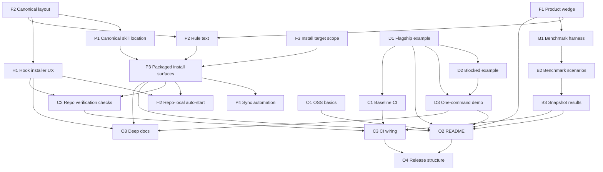

# Unleak Productization Plan

## Goal

Turn `unleak` from a strong local skill scaffold into a packaged, benchmarked, easy-to-install agent extension that people can understand, trust, and adopt quickly.

This plan extracts the useful repo patterns from `caveman` and applies them to `unleak`.

## Current State

What already exists:

- canonical skill spec in `SKILL.md`
- core scripts in `scripts/`
- policy and prompt references in `references/`
- runnable example in `examples/branch_analysis/`
- tests for validator, policy init, and hook behavior in `tests/`
- local Python project metadata in `pyproject.toml`

What is still missing:

- public-facing `README.md`
- multi-agent packaging and install surfaces
- hook install/uninstall flow
- canonical source-of-truth plus synced copies
- benchmark harness with committed result snapshots
- repo verification CI for manifests and generated copies
- OSS polish: license, contributing guide, issue templates, release posture

## Success Criteria

`unleak` should eventually satisfy all of these:

1. A new user can understand the value proposition in under 30 seconds.
2. A new user can install or enable it in one short path for Claude Code and Codex.
3. The repo ships one flagship example that demonstrates blocked raw access and passing sanitized analysis.
4. The repo includes benchmark evidence for utility preservation and leakage reduction.
5. The repo has CI that prevents drift between canonical skill files and packaged copies.
6. The repo is structured for cross-agent reuse, not only local experimentation.

## Repo Strategy

Use one canonical source of truth and sync outward.

Recommended canonical layout:

- `skills/unleak/SKILL.md`: main source of truth for the skill
- `rules/unleak-activate.md`: always-on rule text for agents that use rule files
- `hooks/`: installer scripts, hook entrypoints, and hook docs
- `plugins/unleak/`: Codex plugin bundle
- `.claude-plugin/`: Claude plugin metadata
- `benchmarks/` or `evals/`: benchmark harness and result snapshots
- `docs/`: threat model, install notes, architecture diagram, FAQ

## Workstreams

| Workstream | Outcome | Notes |
|---|---|---|
| WS1 Product positioning | Clear wedge, README, install story, visuals | Needed for adoption |
| WS2 Packaging and distribution | Claude/Codex/Gemini/rule-file install surfaces | Main portability layer |
| WS3 Hooks and enforcement UX | Installable hook flow, project-level examples | Makes behavior feel real |
| WS4 Flagship example and demo | One polished example users can run end-to-end | Main proof surface |
| WS5 Benchmarks and evals | Committed evidence of leakage prevention and signal preservation | Main trust surface |
| WS6 CI and repo verification | Sync checks, manifest checks, example validation | Prevents drift |
| WS7 OSS polish | License, contributing, issue templates, release structure | Low technical depth, high credibility |

## Task Breakdown

| ID | Task | Deliverable | Depends On | Can Run In Parallel With |
|---|---|---|---|---|
| F1 | Define the product wedge | One-sentence positioning, target user, primary use case, non-goals | None | F2, F3 |
| F2 | Establish canonical repo layout | `skills/unleak/`, `rules/`, `hooks/`, `docs/` structure decided | None | F1, F3 |
| F3 | Decide first-class install targets | Explicit scope: Claude Code + Codex first, Gemini second, others optional | None | F1, F2 |
| P1 | Move canonical skill into source-of-truth location | `skills/unleak/SKILL.md` plus compatibility handling | F2 | C1, D1, O1 |
| P2 | Create rule text for always-on variants | `rules/unleak-activate.md` | F1, F2 | H1, D1, O1 |
| P3 | Add packaged copies for target agents | `.claude-plugin/`, `plugins/unleak/`, `gemini-extension.json`, optional rule copies | P1, P2, F3 | H1, D1, O1 |
| P4 | Add sync automation for generated copies | sync script or workflow plus generated target files | P1, P2, P3 | H1, D1 |
| H1 | Package hook installer UX | `hooks/install.sh`, `hooks/uninstall.sh`, `hooks/README.md` | F2 | D1, O1 |
| H2 | Add repo-local auto-start examples | `.codex/` and Claude settings examples if appropriate | P3, H1 | D1, O1 |
| D1 | Harden flagship branch-analysis example | End-to-end passing demo with safe artifact and lineage | None | P1, P2, H1, O1 |
| D2 | Add blocked example path | Fixture or script that intentionally fails validation | D1 | P3, H1, O1 |
| D3 | Add one-command demo runner | Single entrypoint to show discovery -> policy -> artifact -> validation | D1, D2 | P3, H1 |
| B1 | Build benchmark harness | Scripted scenarios, evaluation runner, output schema | F1 | P1, H1, O1 |
| B2 | Add benchmark scenarios and fixtures | Retail, HR, support text, B2B contract scenarios | B1 | P1, H1, O1 |
| B3 | Commit benchmark snapshots and benchmark docs | Reproducible evidence checked into repo | B1, B2 | P3, H1 |
| C1 | Add baseline CI | Run tests and example checks in GitHub Actions | None | F1, F2, F3, D1, O1 |
| C2 | Add repo verification checks | Verify manifests, synced copies, example outputs, hook files | P3, P4, H1 | B1, D1, O1 |
| C3 | Wire sync and verification into CI | CI jobs for test, sync verification, example validation | C1, C2 | B3, O1 |
| O1 | Add OSS basics | `LICENSE`, `CONTRIBUTING.md`, issue templates, funding or support note if desired | None | Almost everything |
| O2 | Write public `README.md` | Hero section, install, before/after flow, demo, benchmark summary | F1, P3, D3, B3, O1 | C2, C3 |
| O3 | Add deeper docs | `docs/threat-model.md`, `docs/install.md`, `docs/faq.md`, diagrams | F1, P3, H1, D3 | C2, C3 |
| O4 | Prepare release structure | versioning policy, changelog or release notes template, first tagged release plan | P3, C3, O2 | O3 |

## Critical Path

These tasks form the main path to a credible first public release:

1. `F1` product wedge
2. `F2` canonical layout
3. `P1` canonical skill location
4. `P2` rule text
5. `P3` packaged install surfaces
6. `H1` hook installer UX
7. `D1` and `D3` flagship example plus one-command demo
8. `B1`, `B2`, `B3` benchmark proof
9. `C2` and `C3` repo verification and CI wiring
10. `O2` public README
11. `O4` release structure

## Parallel Execution Waves

### Wave 0: Foundation

Tasks:

- `F1`
- `F2`
- `F3`
- `C1`
- `O1`

Why this wave:

- These tasks unlock almost everything else.
- They touch different files and can be done without blocking one another.

### Wave 1: Core Packaging and Demo

Tasks:

- `P1`
- `P2`
- `H1`
- `D1`
- `B1`

Why this wave:

- `P1` and `P2` define the canonical distribution inputs.
- `H1` can proceed because hook logic already exists in `scripts/unleak_hook.py`.
- `D1` can proceed because the branch example already exists.
- `B1` can proceed from the benchmark plan already in `references/benchmark-plan.md`.

### Wave 2: Distribution Expansion and Proof

Tasks:

- `P3`
- `P4`
- `H2`
- `D2`
- `D3`
- `B2`
- `C2`

Why this wave:

- These tasks depend on the outputs of Wave 1 but are still mostly independent of one another.

### Wave 3: Integration and Launch Surface

Tasks:

- `B3`
- `C3`
- `O2`
- `O3`

Why this wave:

- This is where the repo becomes externally presentable.
- `README.md` should be written after the example, packaging, and benchmark outputs are real.

### Wave 4: Release

Tasks:

- `O4`

Why this wave:

- Release structure is easiest to finalize after the repo shape and CI are stable.

## Suggested Agent Decomposition

Use agents with disjoint write scopes to reduce merge conflicts.

### Agent A: Packaging

Owns:

- `skills/`
- `rules/`
- `.claude-plugin/`
- `plugins/unleak/`
- `gemini-extension.json`
- optional generated rule targets such as `.cursor/`, `.windsurf/`, `.clinerules/`, `.github/copilot-instructions.md`

Good tasks:

- `P1`
- `P2`
- `P3`
- `P4`

### Agent B: Hooks and Local UX

Owns:

- `hooks/`
- `.codex/`
- hook-related docs

Good tasks:

- `H1`
- `H2`

### Agent C: Demo and Examples

Owns:

- `examples/`
- `assets/templates/`
- example-specific docs or scripts

Good tasks:

- `D1`
- `D2`
- `D3`

### Agent D: Benchmarks and Evals

Owns:

- `benchmarks/`
- `evals/`
- benchmark docs in `references/` or `docs/`

Good tasks:

- `B1`
- `B2`
- `B3`

### Agent E: CI and Repo Verification

Owns:

- `.github/workflows/`
- verification tests such as `tests/verify_repo.py`
- repo validation scripts

Good tasks:

- `C1`
- `C2`
- `C3`

### Agent F: Docs and Launch Surface

Owns:

- `README.md`
- `docs/`
- `CONTRIBUTING.md`
- issue templates
- release notes scaffolding

Good tasks:

- `O1`
- `O2`
- `O3`
- `O4`

Important note:

- `README.md` should be owned by one integration agent late in the process, not edited in parallel with packaging and benchmark work.

## Recommended Delegation Order

If running 4 to 6 agents, use this order:

1. Start Agent A on `P1` and `P2`.
2. Start Agent C on `D1`.
3. Start Agent D on `B1`.
4. Start Agent E on `C1`.
5. Start Agent F on `O1`.
6. Start Agent B on `H1`.

Then, after Wave 1 lands:

1. Agent A continues with `P3` and `P4`.
2. Agent C continues with `D2` and `D3`.
3. Agent D continues with `B2` and `B3`.
4. Agent E continues with `C2` and `C3`.
5. Agent F integrates everything into `O2`, `O3`, and `O4`.

## Dependency Graph

## First Release Scope

For the first serious public release, keep scope tight:

Include:

- Claude Code packaging
- Codex packaging
- one polished branch-analysis demo
- one blocked and one passing validation example
- one benchmark harness with at least 2 scenarios
- CI for tests, sync verification, and example validation
- public `README.md`

Defer:

- all non-core agents beyond Codex and Claude if they slow delivery
- differential privacy implementation
- complex gateway tooling
- broad dataset connector support beyond CSV and SQLite
- heavy design work that does not improve install, trust, or proof

## Done Definition

The repo has reached the target level when:

1. `README.md` communicates the product clearly and links to a working demo.
2. The canonical skill is synced automatically to all shipped install surfaces.
3. Hook installers work without manual JSON editing for the primary target.
4. The example demo proves both block and pass flows.
5. Benchmark snapshots are committed and reproducible.
6. CI fails if packaging copies drift or examples become invalid.
7. A tagged release can be cut without repo surgery.
