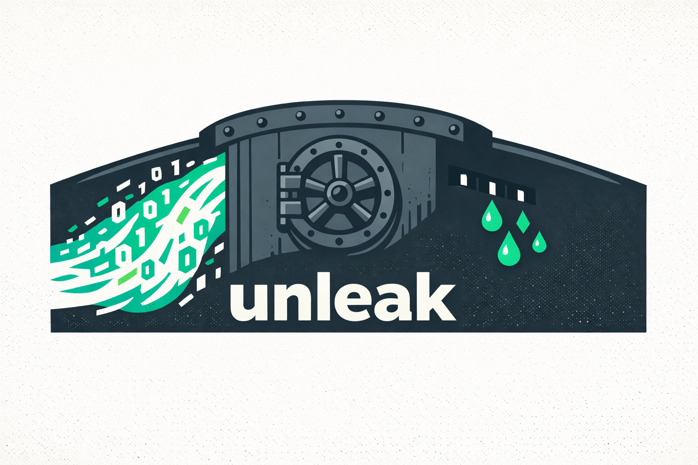

<p align="center">
  
</p>

<h1 align="center">unleak</h1>

<p align="center">
  <strong>local database access guardrails for AI agents</strong>
</p>

<p align="center">
  <a href="#install">Install</a> -
  <a href="#what-it-does">What It Does</a> -
  <a href="#agent-eval-results">Evals</a> -
  <a href="#workflow">Workflow</a> -
  <a href="#sql-scope">SQL Scope</a> -
  <a href="docs/unleak-theory.md">Theory</a> -
  <a href="#test">Test</a>
</p>

---

`unleak` is a self-contained Agent Skill for database work. It helps AI agents answer useful questions about SQLite, Postgres, and BigQuery data without sending raw credentials or unrestricted sensitive columns into the model context.

The core idea is simple: decide column by column what the agent actually needs. Safe values can be shown directly, personal data can be masked, identifiers can be hashed or used only for joins, and unnecessary secrets can be hidden.

This is leakage reduction, not a sandbox. Agent permissions and the query policy engine are practical guardrails for everyday database inspection. For a deeper explanation, see [Theory Behind Unleak](docs/unleak-theory.md).

## What It Does

- Keeps database credentials local and outside the agent's readable context.
- Lets AI agents stay productive with real database questions, not mock data.
- Applies table and column policies before query results are shown to the agent.
- Reduces accidental leakage by masking, hashing, omitting, or blocking protected fields.
- Lets users review and activate policy changes explicitly before they affect access.
- Routes reads through deterministic scripts instead of raw database CLI access, including `psql`, `sqlite3`, and `bq`.
- Supports everyday analysis workflows for SQLite, Postgres, and BigQuery.

## Agent Eval Results

Unleak passes SQLite and Postgres agent evals across Claude and Codex using a realistic privacy-heavy retail dataset. The evals prove that agents can answer business questions with approved `SELECT` queries, show transformed contact data, use pseudonymous join keys, respect hidden fields and disabled tables, avoid raw database CLIs, and never run policy activation.

Reports and reproducibility assets:

- [SQLite Agent Evals](docs/evals/sqlite-agent-evals.md)
- [Postgres Agent Evals](docs/evals/postgres-agent-evals.md)
- [Retail Ops Eval Dataset](docs/evals/datasets/README.md)
- JSON results at `docs/evals/sqlite-agent-evals.json` and `docs/evals/postgres-agent-evals.json`
- Transcript snapshots at `docs/evals/transcripts/` and `docs/evals/postgres-transcripts/`

Rebuild the public reports:

```bash
cd skills/unleak
bun run eval:sqlite:report
bun run eval:postgres:report
```

## Install

Preferred install path:

```bash
npx skills add SainyTK/unleak -a claude-code
```

After install, run dependency setup inside the installed skill folder:

```bash
npm install --prefix .claude/skills/unleak
```

## Setup

After install, open an AI agent session in your project and run:

```text
/unleak init
```

The agent will guide the setup. It can safely do the mechanical setup work:

- check readiness and install missing skill dependencies
- create local config and install deny rules for raw database CLIs
- list configured connections after you create the config
- install agent deny rules
- dump structural schema metadata without sample values
- propose a first policy from the schema
- explain and edit the proposed policy in `./unleak-policy-review/`
- validate the policy file

Some steps require explicit user action by design:

- You create and edit `unleak/local/db-conf.json` yourself, because it contains credentials and the local HMAC secret.
- You manually activate a validated policy with `activate-policy.mjs`, because activation changes what the agent is allowed to query.

Typical manual config bootstrap:

```bash
node .claude/skills/unleak/scripts/init-config.mjs
```

Then edit the config locally:

- set a random `hmacSecret`
- keep only the connections you need
- set SQLite database paths
- set Postgres host, port, database name, username, and password
- for BigQuery, run `gcloud auth application-default login`, then manually copy the ADC JSON into `credentials.adc` and set `credentials.projectId`

After the agent proposes and validates a policy, activate it manually:

```bash
!node .claude/skills/unleak/scripts/activate-policy.mjs ./unleak-policy-review/<connection>.policy.proposed.json
```

## Workflow

After setup is complete, including database config and an active policy, users can ask the AI agent normal questions about the database:

- "Which products grew fastest last month?"
- "Find unusual order patterns."
- "Summarize customer support volume by status."
- "Show revenue by region and week."

The agent will use the skill to inspect schema and run approved `SELECT` queries. The active policy controls access at the column level, so restricted data is hidden, masked, hashed, or limited to join use before results reach the model.

BigQuery uses one policy scope per dataset. Dump all datasets with `dump-schema.mjs --connection <connection>` or one dataset with `--schema <dataset>`. Query BigQuery with both connection and dataset:

```bash
node .claude/skills/unleak/scripts/query.mjs --connection warehouse_bq --schema sales --sql "SELECT amount FROM orders"
```

BigQuery SQL uses local table names only, such as `FROM orders` and `JOIN customers c`. Unleak qualifies the physical BigQuery table after policy validation and performs a dry run before execution. Set the cost cap with `connection.options.maxBytesBilled`.

Policies can be updated later. Users may edit the policy manually or ask the agent to help revise it, explain tradeoffs, and validate the proposal. The agent still cannot activate the update automatically; the user must explicitly run the activation command to prevent accidental policy changes.

## Safety Model

The agent must not read or edit:

- `unleak/local/db-conf.json`
- `unleak/scripts/**`
- `unleak/local/schema/**`
- `unleak/local/active-policies/**`
- `.claude/settings.json`

The agent must not run `activate-policy.mjs`. Activation is a manual user action.

The agent must not use raw database CLIs after setup, including `psql`, `rtk psql`, `sqlite3`, `rtk sqlite3`, `bq`, or `rtk bq`. Users may run `gcloud auth application-default login`; agents must not read ADC source files or `unleak/local/db-conf.json`.


## Policy Types

- `visible`: use for non-sensitive business data the agent can see directly. These columns may be selected, filtered, grouped, sorted, joined, and used in expressions. Examples: status, category, public code, created date, non-sensitive amount.
- `masked`: use for personal or identifying data where partial traceability is useful. The agent may select the column directly, but output is masked. Examples: email, phone number, account number, customer name.
- `hashed`: use for sensitive identifiers that need stable pseudonymous display, comparison, or grouped counts, but not raw exposure. Output is transformed with local HMAC. Examples: customer ID, member ID, transaction ID.
- `joinable`: use for keys needed to connect tables without exposing raw values. These columns may be used for equality joins, grouped counts, and direct pseudonymous selection, but not for filtering, sorting, or calculations. Examples: foreign keys, internal account IDs.
- `hidden`: use when the agent does not need the value. Hidden columns may be used only for grouped counts and must not be selected or referenced elsewhere. Examples: passwords, API keys, access tokens, private notes, sensitive free text.
- disabled object: use for tables or views the agent should not query at all, even if some columns might look safe.

Policies may add explicit `capabilities` to a column when the default type is too coarse for analysis. Valid capabilities are `select`, `filter`, `group`, `sort`, `join`, `aggregate`, and `expression`. This lets a policy owner allow, for example, a hashed `account_id` to be grouped, joined, filtered, or sorted without exposing the raw identifier. Existing policies without `capabilities` keep the default behavior above. Hidden columns may only declare `group`.

## SQL Scope

Supported:

- one `SELECT`
- `SELECT *`
- direct column passthrough
- visible expressions with aliases
- simple joins
- simple CTEs
- simple `FROM` subqueries
- `UNION` and `UNION ALL`
- allowlisted scalar and aggregate functions
- output-alias and direct sortable-column `ORDER BY`
- row caps

Unsupported or conservative:

- DDL, DML, PRAGMA, COPY, ATTACH, DETACH
- transaction and session commands
- temp tables
- `INTERSECT` and `EXCEPT`
- complex recursive CTEs
- broad parser-specific window cases
- unresolved lineage

## Test

```bash
cd skills/unleak
bun run test
bun run test:agent:fixture
bun run test:agent:preflight
bun run eval:sqlite:report
bun run eval:postgres:report
bun run test:postgres
bun run test:postgres:active
```

The default test run skips local Postgres integration. Use `bun run test:postgres` when local Postgres is available. After manually activating `sales_pg`, use `bun run test:postgres:active` to verify the active Postgres policy path.

Agent evals live under `test/agent-evals/`. `bun run test:agent:fixture` validates the SQLite retail dataset and active policy without calling an external agent. `node test/agent-evals/run-agent-evals.mjs --agent fixture --dialect postgres` validates the same fixture flow against Postgres. `bun run test:agent:preflight` checks local Claude/Codex auth and reachability. Use `bun run test:agent:claude`, `bun run test:agent:codex`, `bun run test:agent:sqlite`, or `bun run test:agent:postgres` for real agent transcript checks. Failures save the prompt, transcript, extracted commands, and diagnosis under `test/agent-evals/failures/`.
